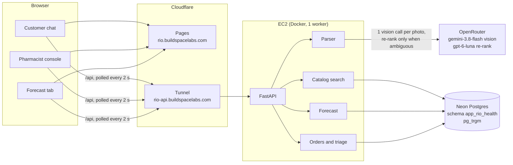

# Rio: prescription to pharmacist-verified cart

A customer sends a photo of a prescription in a WhatsApp-style chat. Rio reads it, matches
every line to a real Indian medicine SKU, builds a cart with cheaper generic alternatives,
and puts the order in front of a pharmacist. The pharmacist clears it in seconds, because
every line arrives marked green (approve as is), amber (check against the photo) or red
(fix before approving). A forecast tab shows demand by SKU, area and hour, with stockout
alerts and reorder quantities.

- **App:** https://rio.buildspacelabs.com (also https://rio-health.pages.dev)
- **API:** https://rio-api.buildspacelabs.com/api/health
- **How it was built and why:** [docs/explainer.html](docs/explainer.html),
  [docs/DECISIONS.md](docs/DECISIONS.md)

## The one rule it is built around

Schedule H and H1 drugs need a pharmacist's check before they are dispensed, and a
prescription photo almost always contains them. So **every prescription order goes to a
pharmacist.** The AI never decides *whether* an order is reviewed. It decides *how fast*
the review can be:

| Line | When | Pharmacist |
|---|---|---|
| ✕ red | No SKU, drug name unreadable, or catalog match below 0.6 | Must edit or remove |
| ! amber | Match below 0.85, a field missing (e.g. no strength written) or unclear | Check against the photo |
| ✓ green | Everything else | One tap |

Confidence is computed from things that can be checked (catalog match score, which fields
were written, which were legible), never taken from the model's own say-so. Typed orders
for over-the-counter medicines ("dolo and ORS") skip the queue; a typed request for an
Rx-only medicine asks for a prescription.

## Architecture



A photo becomes a cart in four steps:

1. **Read.** The image is shrunk to 1600 px (in the browser, then again on the server) and
   sent in one vision call that returns strict JSON: each line as written, plus drug,
   strength, form, frequency, duration and a list of fields it could not read. The model
   knows nothing about the catalog.
2. **Normalize in code.** `1-0-1` → 2 doses a day, `x 5 days` / `5/7` → 5 days. Packs are
   computed in code, never by the model: 2 a day × 5 days = 10 tablets → 1 strip of 10.
3. **Match.** Trigram search over 9,303 SKUs by brand and by composition. A clear winner is
   taken directly; close calls go to a cheap text model that picks one of the top 5. The
   pick is only promoted to green if its strength and form agree with the line, checked
   in code.
4. **Cart.** Generic alternative (same salts and strength, cheapest per unit), price,
   triage and a reason for every amber or red line.

The running app reads only the database. Seed files, the Schedule H list and sample images
are inputs that scripts load into Neon.

## How accurate it is

20 synthetic prescriptions rendered from 4 clinic layouts in print and handwriting fonts,
then degraded to look like phone photos (rotation, blur, JPEG compression, uneven light).
77 medicine lines. Answer keys come from the catalog entry for the brand written on each
prescription, never from what the matcher picked.

| Run | Lines found | Fields read right | **Right SKU** | Green | Green but wrong | p50 / p95 | Cost per Rx |
|---|---|---|---|---|---|---|---|
| Matcher only, perfect reading, no re-rank | 100% | 100% | **100%** | 60% | 0 | 1.4 s / 1.9 s | $0 |
| Matcher only, perfect reading, with re-rank | 100% | 100% | **100%** | 77% | 0 | 4.0 s / 7.0 s | $0.0001 |
| **Gemini 3.8 Flash reading the images, with re-rank** | **100%** | **100%** | **100%** | 71% | **0** | 14.0 s / 23.1 s | **$0.0074** (≈ ₹0.62) |

*Green but wrong* is the number that matters most: a green line that is actually wrong is
the one mistake a pharmacist might wave through. It is zero in every run.

What these numbers do **not** show yet:

- **Real handwriting.** Synthetic handwriting fonts are far easier than a doctor's pen.
  The harness scores a separate handwritten set (`eval/handwritten/`), reported apart and
  never blended, but those photos aren't in yet. Expect the real number to be lower; low
  confidence lands in the pharmacist's amber and red lines by design.
- **One vision model.** Only Gemini 3.8 Flash was run; `eval/run.py --model <id>` compares
  others.
- Latency above is with 4 prescriptions in flight at once. A single upload took 10–14 s.

Reproduce: `cd backend && uv run python ../eval/run.py --model google/gemini-3.8-flash --set synth`.

## The catalog

The "A-Z Medicine Dataset of India" (about 254,000 rows, MIT-licensed mirror), trimmed to
**9,303 SKUs across 1,541 compositions**, 74.6% of them prescription-only.

- Salts are normalized into a `composition_key` such as
  `amoxycillin 500mg + clavulanic acid 125mg`. Equal keys mean substitutable, which is
  where "Save ₹42.50, switch to generic" comes from.
- Spelling variants that refer to the same drug (amoxicillin / amoxycillin, acetaminophen /
  paracetamol) are an explicit list, not fuzzy merging. In this dataset almost every pair
  of look-alike names is a *different* drug (cefixime / cefepime, clonazepam / lorazepam,
  quinidine / quinine), and a test guards them. `scripts/etl/propose_aliases.py` suggests
  candidates for a person to approve.
- Prescription-only comes from a hand-curated list of about 300 Schedule H/H1/X salts. It
  is approximate.

## The forecast

Demand data is **synthetic**: 90 days of hourly orders for 50 SKUs across 3 areas, with an
evening peak, a different mix per area and a flu-style spike in the last 21 days.

- Model: hour-of-week profile × a 7-day moving level.
- Backtest over the last 14 days: **22.9% error, against 28.5% for "same hour last week"**,
  better on 134 of 150 series; 18.4% vs 23.5% on the spike medicines.
- Reorder quantity = demand over the 24 h lead time × 1.2 − stock on hand; 14 of 150
  SKU-area pairs are flagged as stockout risks.

## Run it

```bash
cp .env.example .env    # RIO_HEALTH_DATABASE_URL, OPENROUTER_API_KEY, VISION_MODEL, RERANK_MODEL
cd backend && uv sync && uv run python -m app.core.migrate && uv run uvicorn app.main:app --port 8000
cd frontend && npm install && npm run dev        # http://localhost:5173
```

No keys? `RIO_USE_MOCKS=1` (backend) or `VITE_MOCKS=1` (frontend) runs the whole flow on
fixtures. Tests: `cd backend && uv run pytest -q` (490 tests; DB tests need the Neon URL)
and `cd frontend && npm test` (93).

Deploy the API: [deploy/README.md](deploy/README.md) (EC2 + Docker + Cloudflare Tunnel).
Deploy the frontend (Cloudflare Pages project `rio-health`, direct upload):

```bash
cd frontend && VITE_API_BASE_URL=https://rio-api.buildspacelabs.com npm run build
npx wrangler pages deploy dist --project-name rio-health --branch main
```

## Layout

```
backend/     FastAPI: api/ routes, orders/ triage and state machine, parser/, catalog/, forecast/
frontend/    Vite + React + TypeScript: chat, pharmacist console, forecast tab
contracts/   API.md, schema.json and the generated TypeScript types, mock fixtures
data/        catalog seed and the Schedule H list (ETL inputs)
eval/        synthetic and handwritten sets, the scoring harness, results
deploy/      Dockerfile, compose, Cloudflare Tunnel, deploy script
docs/        decisions, plan, agent briefs, per-branch verification notes, QA runbook
```

## What I'd build next

1. **The WhatsApp Business Cloud API.** The chat is already a state machine over
   messages; swapping the web UI for webhook in, template messages out is mostly
   transport.
2. **The real handwriting number,** then a model comparison on it. Handwriting is where
   accuracy will drop, and the honest number decides how much of the pharmacist's time the
   triage actually saves.
3. **Pharmacist feedback as training signal.** Every edit is a labelled correction (what
   the model read, what the pharmacist chose). Use it to grow the alias list, tune the
   triage thresholds and pick few-shot examples.
4. **A drug vocabulary instead of a hand list.** RxNorm-style synonyms or the WHO INN list
   for salt names, and CDSCO's schedules for the Rx-only flag.
5. **Popularity from Rio's own orders,** rebuilt daily, replacing the dataset's row order
   for search tie-breaks and generic suggestions.
6. **Forecasts on real order history,** with holidays, weather and outbreak signals, and
   per-store lead times.
7. **Auth, payments, delivery tracking** and an audit trail of who approved what.
