# Verify: `feat/frontend`

## Run it

```bash
cd frontend
npm install
VITE_MOCKS=1 npm run dev          # http://localhost:5173, in-browser mock API
npm test                          # vitest: 77 tests (mock state machine, money, review helpers, resize, edge cases, HTTP client)
npm run build                     # tsc + vite build
npm run gen:contracts -- --check  # contracts.gen.ts is current
```

Without `VITE_MOCKS=1` the client calls `VITE_API_BASE_URL` (default `http://localhost:8000`).

About the mock:
- It is seeded from `contracts/fixtures/` and keeps real state: prescription and sample orders go to
  `pending_review` after 2 s of fake parse latency; review → `verified` or `rejected`; typed orders →
  `confirmed_otc` or `needs_prescription`; swap and place follow the rules in `contracts/API.md`
  (409 on invalid transitions).
- State lives in `localStorage` (`rio.mock.v1`), so `/chat` and `/pharmacist` in two tabs share orders.
  **Reset demo** (top right) clears it back to the seeded queue, so each Loom take starts clean.
- To rehearse failures, add `?fail=` to the URL with `unsupported_image` (400), `image_too_large` (413),
  `rate_limited` (429), `parser_failed` (502) or `parser_timeout` (504). The next photo upload then fails
  with that code and the chat offers "Try a sample".
- To rehearse a slow parse, add `?latency=20000`: the parse then takes 20 s.
- In mocks, any uploaded photo parses as the 3-line Sunrise Clinic prescription. The console
  shows the photo you uploaded.

## Routes

| Route | What |
|---|---|
| `/` | Demo mode: phone-framed chat on the left, pharmacist console on the right, one shared state. Below 900 px they become Customer and Pharmacist tabs. |
| `/chat` | Customer chat on its own; full screen at 390 px. |
| `/pharmacist` | Queue plus order review. |
| `/forecast` | Backtest headline, SKU and area picker, actual vs forecast chart with a "now" line, reorder table. |

## Loom script, click by click (on `/`, 1440×900 or larger)

0. Click **Reset demo**. The queue already holds two orders so it looks lived-in.
1. **0–10 s.** Open on `/`, with the greeting and quick replies on the phone.
2. **10–40 s.** On the phone, click **📷 Upload prescription** and pick a photo. Or click **Try a sample**
   → **Typed clinic Rx, 3 lines**. You'll see "Reading your prescription…" with typing dots for about 2 s,
   then the cart card (Augmentin, Pan 40, Dolo 650, total ₹412.10) with a **Save ₹42.50 — switch to
   generic** chip and "A pharmacist is verifying your order." Click the chip: Augmentin becomes
   Moxclav 625 and the total drops to ₹369.60. On the right, the new order arrives in the queue marked
   **New** and opens on its own, with lines grouped **Fix before approving** (red ✕), **Check these**
   (amber !) and **Read cleanly** (green ✓).
3. **40–60 s.** On the red line 3 ("Tab D?lo 650 SOS"), click **✎ Edit**. The SKU picker opens,
   pre-searched with "Dolo 650". Pick a SKU, set the packs, then click **Use this SKU**. Click **✓ Approve
   all green**, then **Approve order**. Approve stays disabled until the red line has a decision. Within
   2 s the phone shows the **Verified by pharmacist** stamp, the final cart with changed lines struck
   through (or "Confirmed by the pharmacist"), and **Place order · ₹…**. Click it.
4. **60–75 s.** The accuracy table lives in the README, not this UI.
5. **75–90 s.** Click **Forecast**. It opens on Dolo 650 in Area A: the actual line spikes just before
   "now", the forecast picks up the higher level, and the reorder table's first row is red
   **Stockout risk** with hours to stockout and a reorder quantity. Click any row to chart it.

Other paths:
- Type `dolo, ORS` in the chat to get an OTC cart and **Place order** straight away.
- Type `augmentin` to get "Augmentin 625 Duo needs a prescription. Upload one?"
- In the console, **Reject with note** requires a note, and the chat then shows it.

## Screenshots

Captured with Playwright against `VITE_MOCKS=1` (script walks the path above).

| | |
|---|---|
| Split screen, cart and queue | 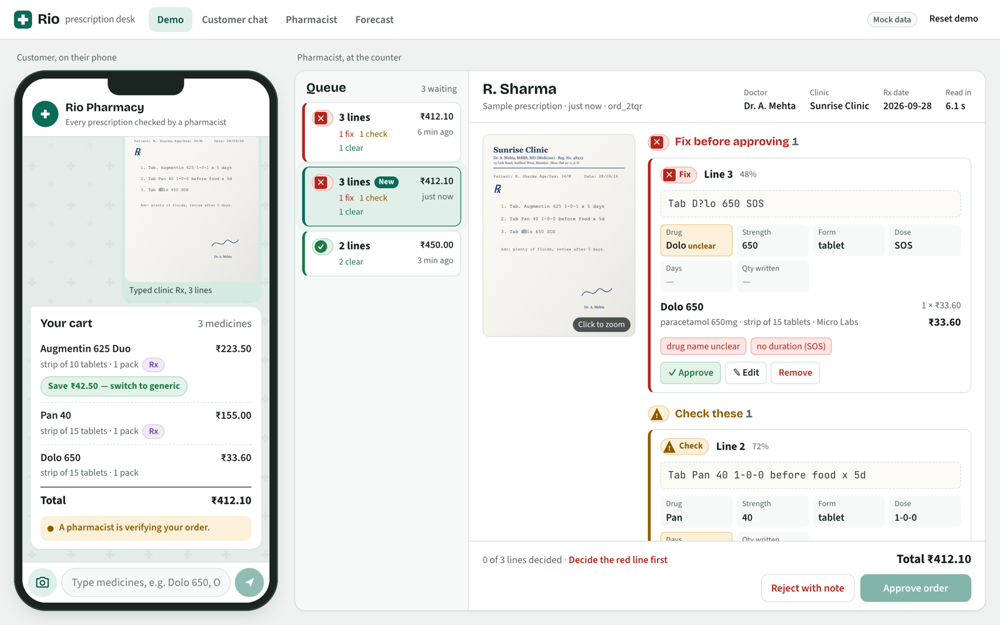 |
| Pharmacist editing the red line | 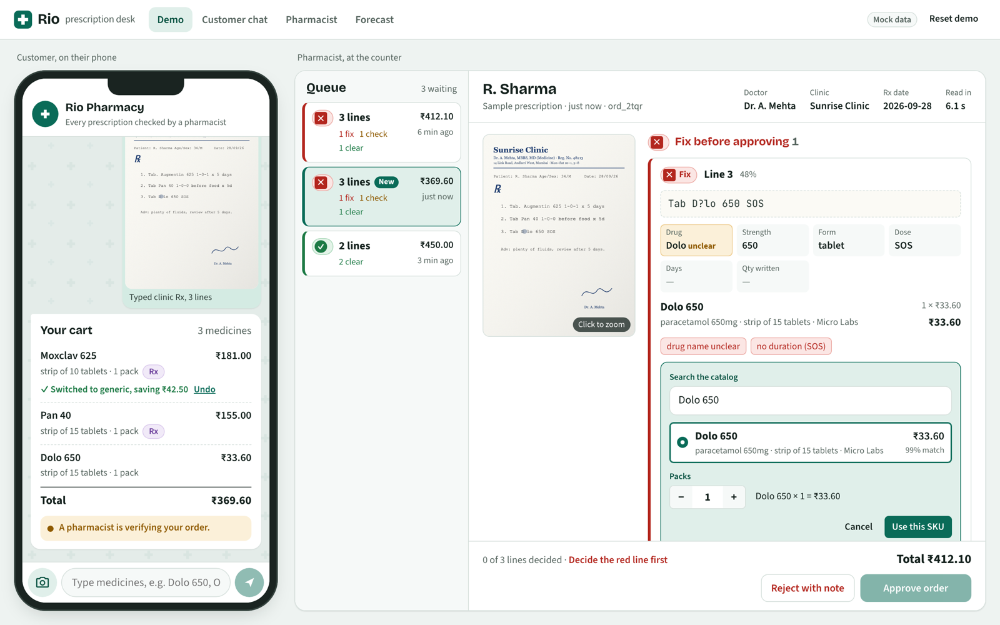 |
| Verified: chat turns green | 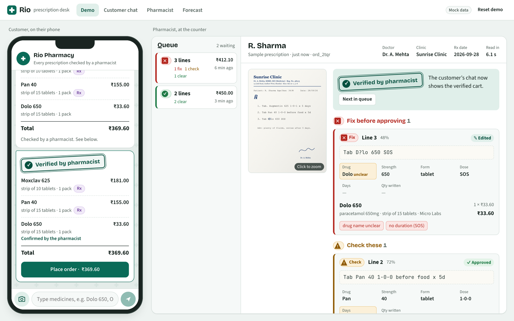 |
| Forecast tab | 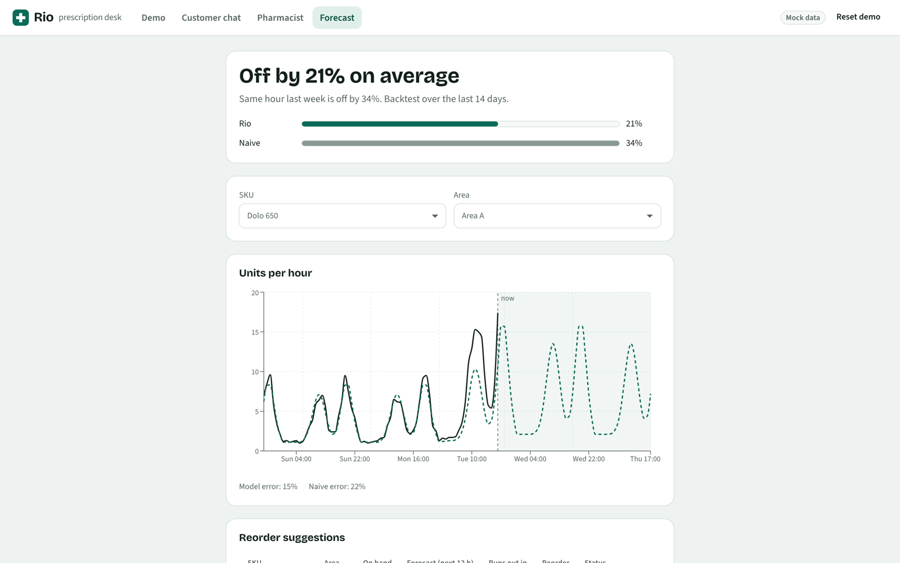 |
| `/chat` at 390 px | 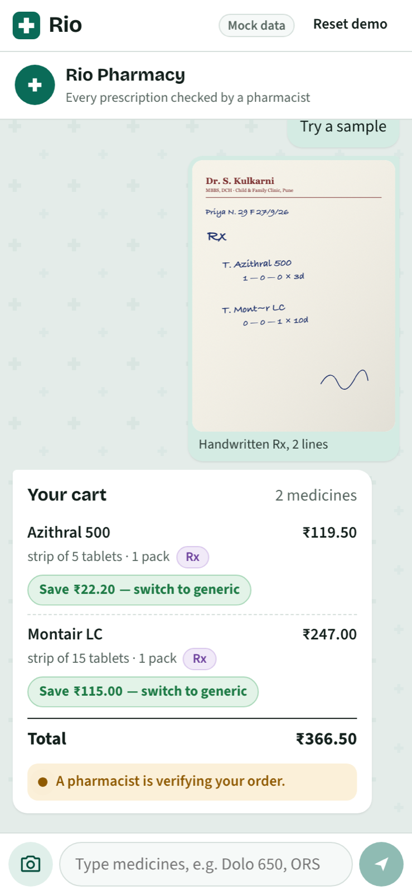 |
| Demo at 390 px, Pharmacist tab | 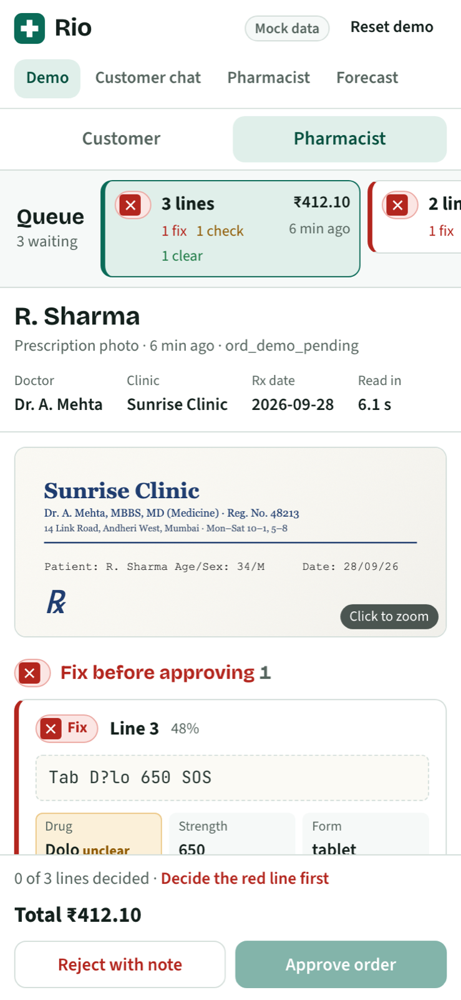 |
| Typed OTC, Rx needed, parser failure → Try a sample | 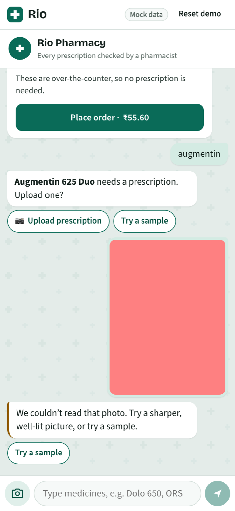 |

## Design notes

- The tokens match `docs/explainer.html`: calm teal `#0a6b58`, cool paper, Bricolage Grotesque for
  headings, Source Sans 3 for body text, JetBrains Mono only for prescription lines as written.
- Triage never relies on colour alone. Each level has its own shape, glyph and word: green circle ✓
  "Clear", amber triangle ! "Check", red square ✕ "Fix".
- Prices use tabular numerals and `formatINR` (`₹1,234.50`, Indian grouping, always two decimals).
- The only flourish is the pharmacist's stamp.

## Wave 2, part A: real-data edge cases (still on mocks)

| Case | Where to see it | Behaviour |
|---|---|---|
| Long brand name | **Try a sample** → **Messy Rx, 4 lines (edge cases)** | "Augmentin 625 Duo Tablet (Dispersible)" wraps cleanly in the cart, console and picker |
| `sku: null` line | same sample, line 2 | Always red. Chat: "We couldn't identify this line; the pharmacist will check." Console: "No SKU matched", Approve is disabled, and the pharmacist must edit or remove the line |
| `generic_alternative: null` | same sample (Thyronorm, Telma) | No swap chip |
| 0 parsed lines | **Blurry photo, nothing readable** | Chat: "We couldn't read any medicines in that photo…" with Upload and Try a sample. Console: "No medicines were read", Approve is disabled, reject with a note |
| Typed Rx-only | type `azithral 500` | "Azithral 500 needs a prescription. Upload one?" |
| Slow parse | `?latency=20000` | After 8 s the typing bubble changes to "Still reading… handwritten prescriptions take a little longer." At 90 s the client gives up (fetch is aborted) and shows a 504-style message with Try a sample |
| 400 | `?fail=unsupported_image` | "That file isn't a photo we can read…", followed by the server's message |
| 413 / 502 / 504 / 422 | `?fail=…` | Shows `error.message` verbatim. If a proxy returns a non-JSON body, friendly fallback copy is used |
| 429 | `?fail=rate_limited` | "Try again in N minutes", with N read from the server's message |
| 409 | e.g. swapping after the pharmacist reviewed | The chat reloads the order and shows its current state. The console reloads the order and says it was already reviewed |

**Production bundle.** The mock is loaded with a dynamic `import()` behind `VITE_MOCKS`, which Vite
constant-folds. A production build (`VITE_MOCKS` unset) contains no mock code and no fixtures; a grep for
fixture strings finds nothing. JS is 261.9 kB (80.7 kB gzip) for the entry, plus 365.8 kB (105.6 kB gzip)
for the lazily loaded forecast tab with Recharts. The build still needs `../contracts` on disk to resolve
the (dropped) mock import, which holds when Pages builds from the repo root with root dir `frontend/`.

| | |
|---|---|
| Slow parse reassurance | 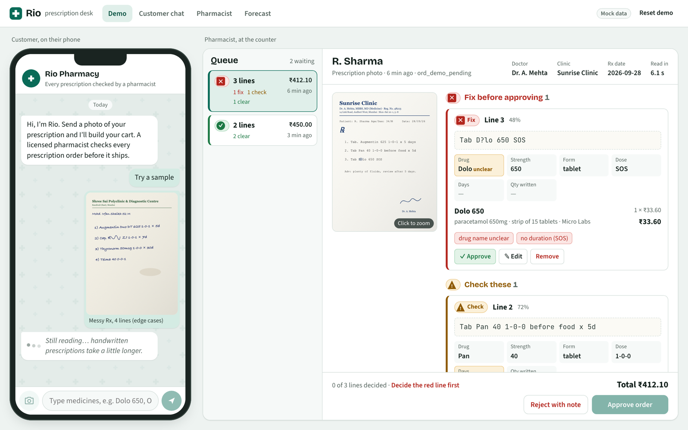 |
| Edge cases: long name, unmatched line | 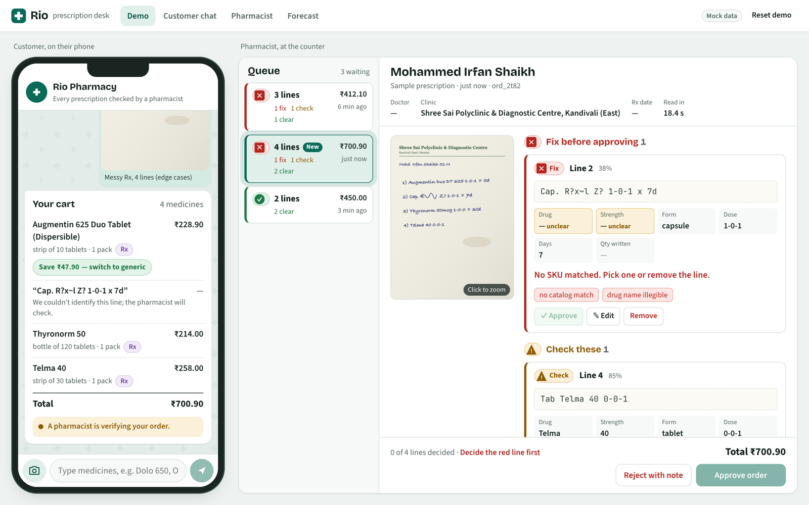 |
| Zero lines parsed (390 px) | 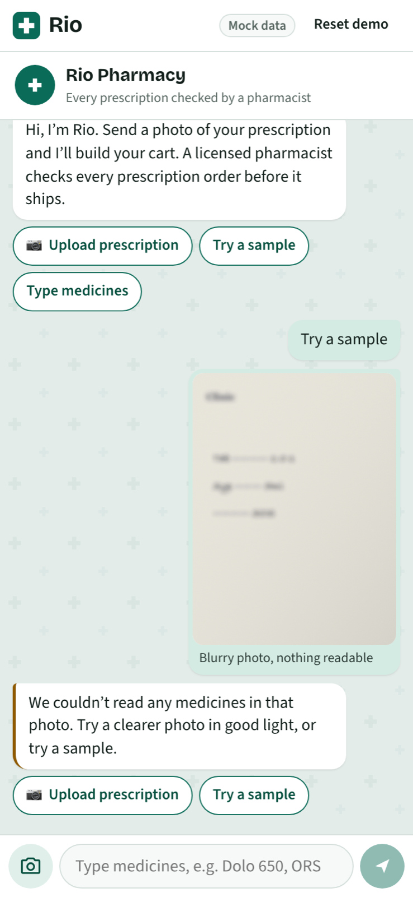 |
| 429 with retry minutes (390 px) | 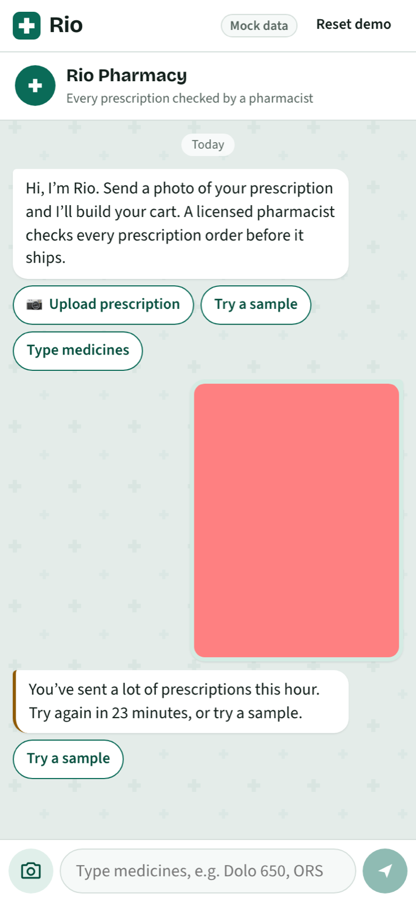 |

## Part B: real API

Run against `feat/backend-api` at bd7da57, in real mode with the Neon database:

```bash
# terminal 1: backend (from its worktree; .env linked, mocks off by default)
cd <backend worktree>/backend && uv sync && uv run uvicorn app.main:app --port 8000
curl localhost:8000/api/health      # {"ok":true,"mocks":false,"database":true}

# terminal 2: frontend, no VITE_MOCKS
cd frontend && VITE_API_BASE_URL=http://localhost:8000 npx vite --port 5173
```

Use port 5173. The backend's CORS allow-list accepts `http://localhost:5173`; a preflight from another
port (for example 5199) gets a 400.

**Walked on real data, at 1440×900 and 390 px, with no console errors and no failed requests:**

1. On `/`, **Try a sample** lists the 3 real samples. **Hospital OPD Rx, 4 lines** gives a cart
   (₹684.01) with 4 swap chips.
2. **Swap chip** on Azithral 500 switches it to Zady 500, saving ₹20.77; the total becomes ₹663.24.
   Checked live with curl: after `use_generic: true`, `sku == generic_alternative` and `savings_inr` keeps
   the saving; `use_generic: false` restores the brand; a swap after review returns 409.
3. The console opens the new order, marked **New**, among about 8 real pending orders. On the amber Montair LC line, **Edit**
   opens the real catalog picker, pre-searched with "Montair LC". I picked #2 and set 2 packs, then
   **Approve all green** and **Approve order**.
4. Within 2 s the chat shows **Verified by pharmacist**, with Montair-LC struck through and the new line and
   pack count shown, total ₹663.24 → ₹581.58. **Place order** gives "Order placed."
5. At 390 px: typing `dolo and ORS` gives `confirmed_otc` (₹52.07) and Place order. Typing `augmentin` gives
   "Augmentin 625 Duo needs a prescription. Upload one?" The **Handwritten-style Rx** sample → Pharmacist tab →
   approve → the chat is verified. No horizontal scroll on any view.
6. **Forecast** reads the real `/api/forecast/summary`: "Off by 23% on average" vs naive 29%, 50 SKUs × 3 areas,
   150 reorder rows (14 at stockout risk).
7. **One real photo upload** (the handwritten-style sample JPEG, 1179×1600, sent through the file input):
   14 s end to end. The "Still reading…" message appeared at 8 s; the result was a 3-line cart with swap chips, and
   the console opened it.

**Not checkable on real data yet:** no real sample produces a **red** line, so the red-line path (blocked
approval, `sku: null`, forced edit or remove) was checked on mocks only. Use the **Messy Rx (edge
cases)** mock sample.

**Frontend fixes from the real run:**
- SKU picker: real search returns ties (for example 5 × 0.86 for "paracetamol 650"). Rows now show their rank
  (`#1`, `#2`, …), print a match percent only when it differs from the row above ("same match"
  otherwise), and a hint explains that ties are ranked by how often they sell.
- Forecast opens on the at-risk series with the most demand (a spike SKU, e.g. Crocin 650 in Area B) instead
  of the soonest stockout (Telma 40). The reorder table shows only the at-risk rows, with a "Show all 150"
  toggle. The "Forecast (next 12 h)" column is renamed "Demand over lead time", because the lead time comes
  from the backend.
- Sample orders report `latency_ms: 0`, so the console hides "Read in" when it is 0.

| | |
|---|---|
| Split screen, real cart and queue | 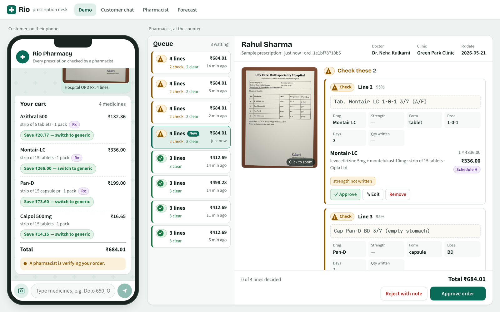 |
| Pharmacist edit with the real picker | 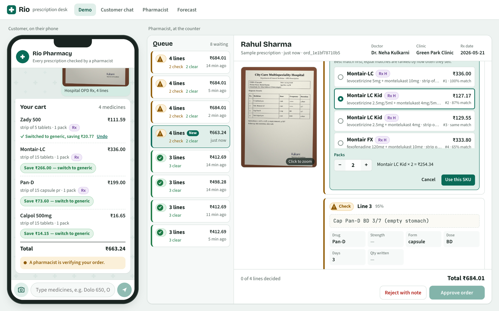 |
| Verified on real data | 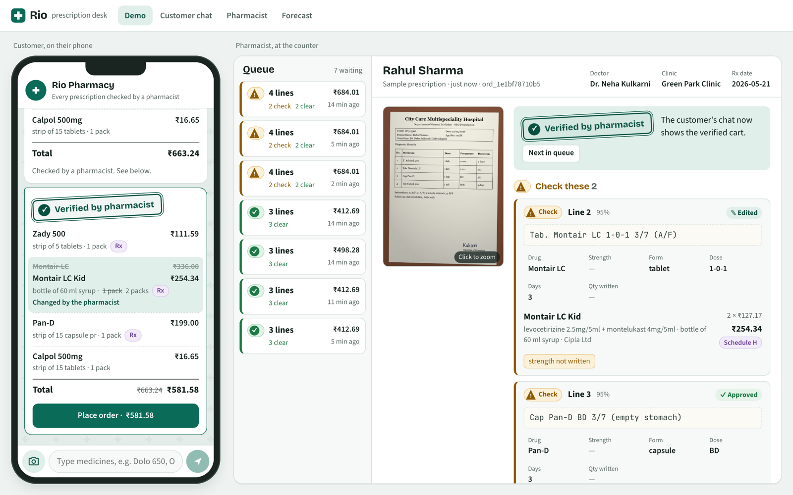 |
| Real forecast | 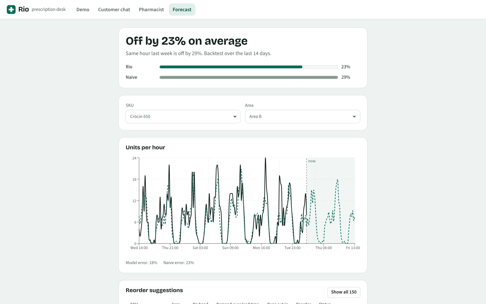 |
| 390 px: typed OTC and Rx-only | 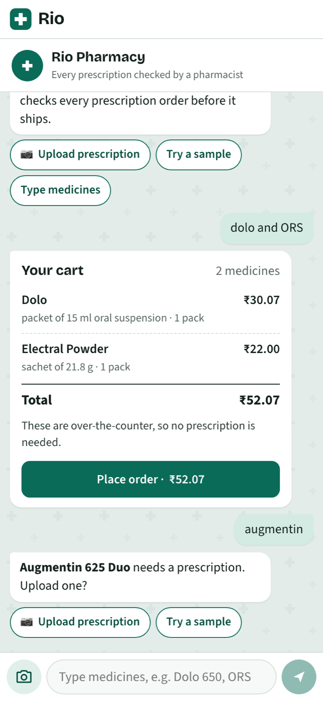 |
| 390 px: sample cart | 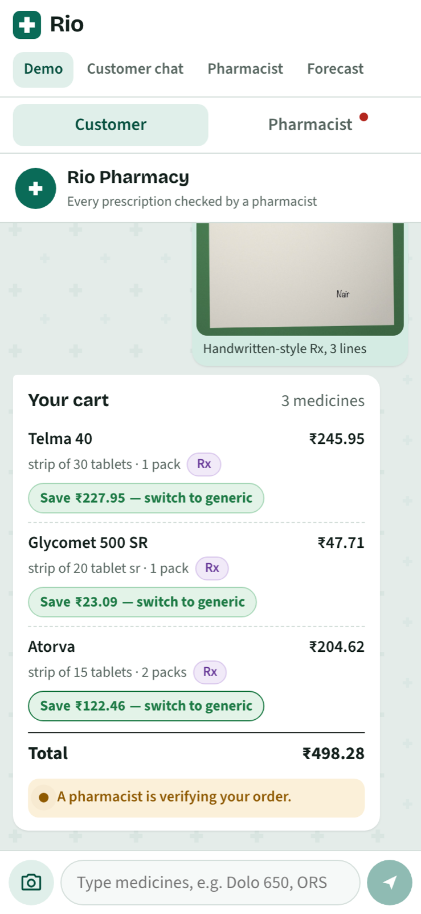 |
| 390 px: pharmacist tab | 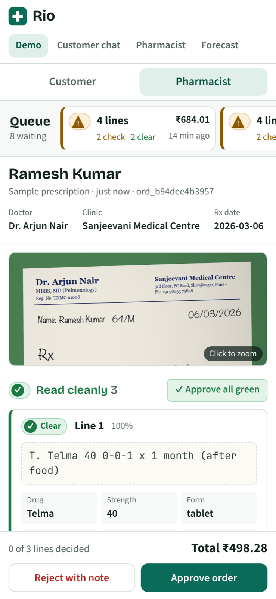 |
| 390 px: verified | 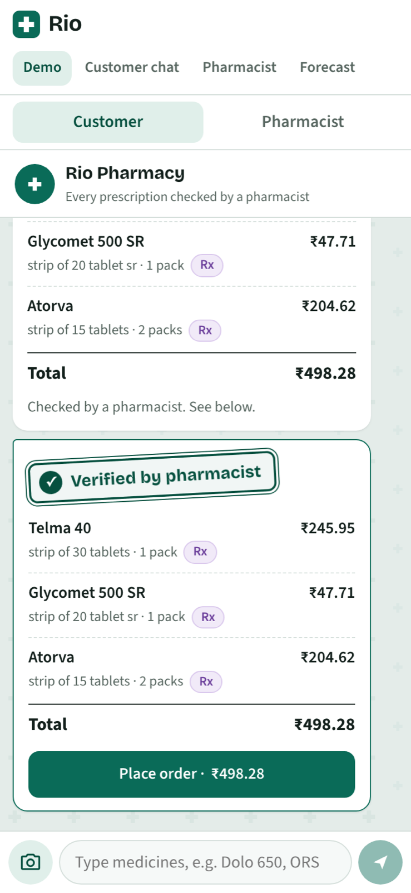 |
| Real photo upload, still reading | 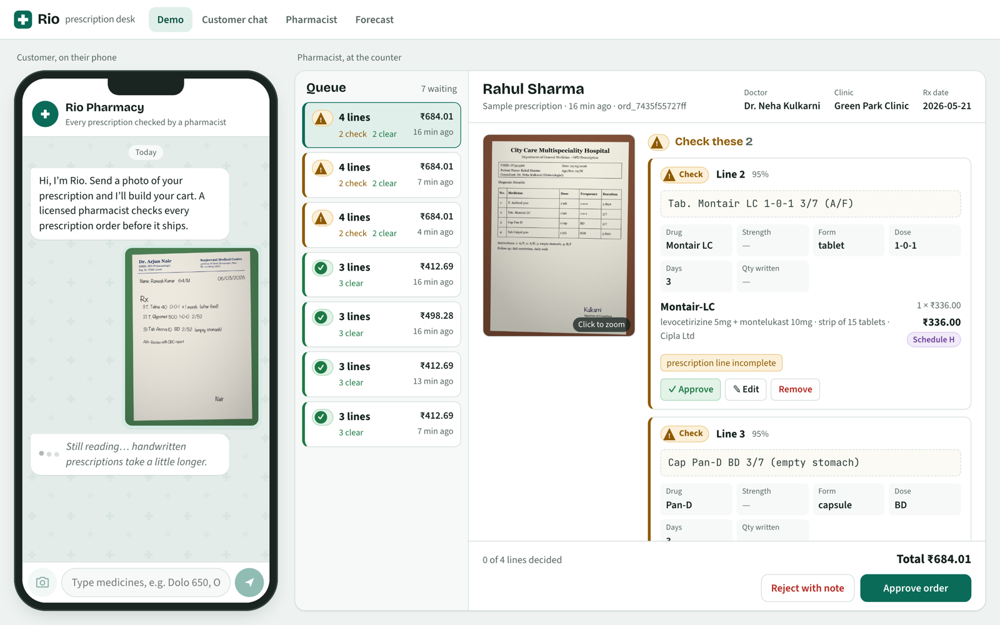 |
| Real photo upload, cart | 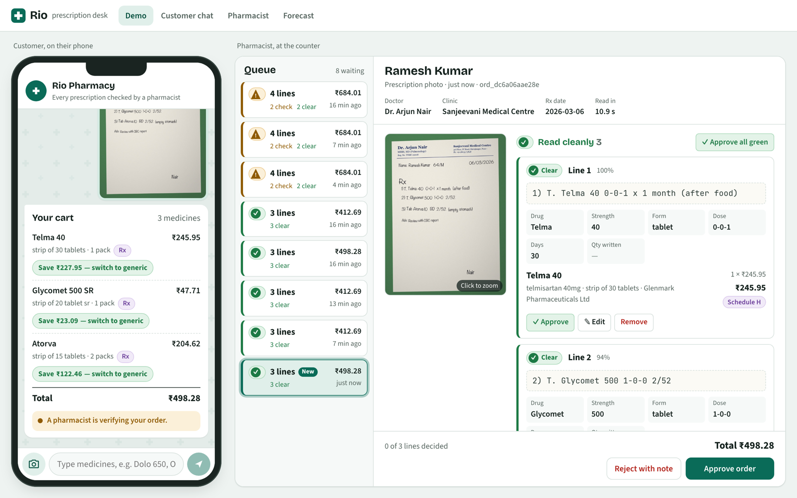 |

## Before production

- Build with `VITE_API_BASE_URL=https://rio-api.buildspacelabs.com` and no `VITE_MOCKS`. The Pages origin
  must be on the backend's CORS allow-list.
